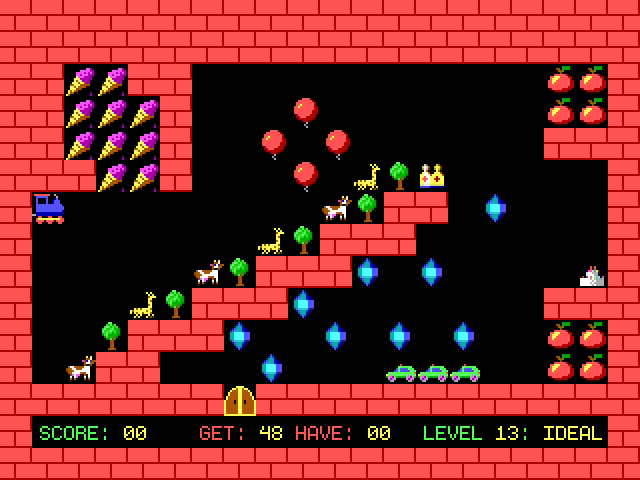

# vlak64

Reimplementation of classic DOS game Vlak for Nintendo 64 using libdragon SDK.

## Building

Vlak 64 was developed using the `preview` branch of libdragon.

Build the ROM by cloning this repository and running `make`.

## Playing

Run in ares emulator or on real hardware using a flashcart.

